 

 

## 👋 About Me

I'm a **Full Stack Developer** currently diving deep into **AI, Python, and LLMs** — building applications that blend solid engineering with intelligent, model-powered features. I enjoy turning ideas into working products and constantly learning new tools along the way.

- 🔭 Currently working on production web applications @ **Mastersoft**
- 🤖 Currently focused on **AI/ML, Python, and LLM-powered projects**
- 🌱 Learning: LangChain, RAG pipelines, prompt engineering & fine-tuning
- 💬 Ask me about React, Node.js, .NET, SQL, Python, or LLMs
- ⚡ Fun fact: I'd rather refactor than write a README... yet here we are 😄

 

## 🛠️ Tech Stack

  

 

## 🤖 AI / ML / Python

  

 

> 🧠 **Currently building:** AI-powered apps using Python, LLMs (OpenAI / open-source models), and LangChain — from RAG-based assistants to LLM-integrated tools.
>
> ℹ️ Note: GitHub strips all custom CSS/JS from READMEs, so true hover-triggered glow/motion effects can't run here — icons above use a clean, uniform dark-theme grid instead of clashing flat-color blocks for a more premium look.

 

  

 

### Quick overview

> These stats are live and update automatically — the rank meter animates from 0 up to my actual rating every time this page loads.

 

### 🔥 Streak stats

  

 

### 📈 Activity graph

  

 

### 🏆 Trophies

  

 

## 📌 Featured Projects

 

